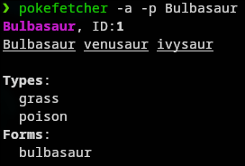

# Welcome to Pokefetcher!
Pokefetcher is a program that I made because I like pokemon and I use Linux (arch btw), so it was only natural.

# How does it work?
The program is quite simple, as intended. It is a small zsh script file that pulls data from [PokeAPI](https://pokeapi.co), which has LOADS of data to pull from. 

As of now (v1.0), the program can pull Evolution Chains, Types, and Variants. 

To use the program, you run `zsh pokefetcher.zsh -p <pokemon> [Flags]`. The flags are as follows:

- -t, --types: Fetch Types
- -f, --forms: Fetch Variants
- -a, --all-pokemon: Fetch both Types and Forms.
- -h, --help: View the Help menu
- -v, --version: Displays Version Number

# Installation
The program is just a Z Shell script, so you can just download it and use it as is, but you can also remove the extension, grant it execution privileges, and then add it to PATH to run it from anywhere. 

I am not a Linux wiz, so I don't want to give an `install.sh` for saftey's sake, but here is what I have done:

`mv pokefetcher.zsh pokefetcher` (Or you can use the [this one](pokefetcher), which is already renamed)

`chmod +x pokefetcher`

Add where ever the file is to PATH in `~/.zshrc` or move it to `/bin`. You can add a directory to the PATH by adding  the line `export PATH="$PATH:where/your/script/file/is"`.

And just like that, you should be able to run the file from anywhere! Make sure that it doesn't conflict with any other programs!

If you have questions, run `pokefetcher -h`, examine the script, or [submit an issue](https://github.com/EasyOnHard/pokefetcher/issues/new). I will try to respond when I can.

# Planned Changes
I might add all of these, I may add none, but they are things that I would like to see in the program.

- TLDR (Teal Deer) Page
- Support for more verbose evolution details (level, other requirements)
- --egg-group, --stats, and --gender-ratio flags